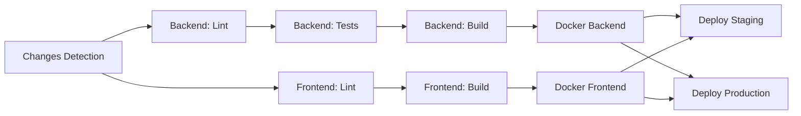

# 🎼 Orchestra CI/CD Workflows

Універсальні GitHub Actions workflows для Orchestra проекту.

## 📁 Структура

```
.github/workflows/
├── ci.yml                    # ⭐ Головний CI/CD pipeline
├── release.yml               # 📦 Автоматичний release
└── dependency-check.yml      # 🔒 Перевірка безпеки залежностей
```

## 🚀 Workflows

### 1️⃣ **ci.yml** - Головний CI/CD

**Тригери:**
- Push в `main` або `develop`
- Pull Request до `main`
- Manual (workflow_dispatch)

**Що робить:**



**Jobs:**

1. **changes** - Визначає що змінилось (backend/frontend/k8s)
2. **backend-lint** - golangci-lint + gofmt
3. **backend-test** - Тести з PostgreSQL
4. **backend-build** - Go binary для Linux
5. **frontend-lint** - ESLint
6. **frontend-build** - Vite build
7. **docker-backend** - Build і push backend image
8. **docker-frontend** - Build і push frontend image
9. **deploy-staging** - Auto deploy до staging (develop)
10. **deploy-production** - Manual deploy до production (main)

**Оптимізації:**
- ✅ Кешування Go modules і npm packages
- ✅ Паралельне виконання backend і frontend jobs
- ✅ Вибіркове виконання (тільки що змінилось)
- ✅ Docker layer caching через GitHub Cache
- ✅ Автоматична відміна старих runs при новому push

---

### 2️⃣ **release.yml** - Автоматичний Release

**Тригер:**
```bash
git tag v1.0.0
git push origin v1.0.0
```

**Що створює:**
- 📦 Backend binaries (Linux, macOS Intel/ARM, Windows)
- 📦 Frontend dist archive (tar.gz)
- 🐳 Docker images з версією і `latest` тегом
- 📝 GitHub Release з changelog
- 📊 Release notes (автогенерація)

**Використання:**
```bash
# 1. Створи тег
git tag -a v1.0.0 -m "Release version 1.0.0"

# 2. Push тег
git push origin v1.0.0

# 3. GitHub Actions автоматично:
#    - Збере бінарники
#    - Створить Docker images
#    - Опублікує GitHub Release
```

**Docker images:**
```bash
# Pull released version
docker pull ghcr.io/rsmrtk/orchestra/backend:1.0.0
docker pull ghcr.io/rsmrtk/orchestra/frontend:1.0.0

# Pull latest
docker pull ghcr.io/rsmrtk/orchestra/backend:latest
```

---

### 3️⃣ **dependency-check.yml** - Безпека

**Тригери:**
- Push в `main`/`develop`
- Pull Request
- Щотижня в неділю о 00:00
- Manual

**Перевірки:**
- 🔍 `govulncheck` - Вразливості в Go залежностях
- 🔍 `npm audit` - Вразливості в npm packages
- 📦 Outdated dependencies
- 🔒 Dependency Review (для PR)

---

## 🎯 Як використовувати в інших проектах

### 1. Скопіювати workflows

```bash
# Скопіювати в свій проект
cp -r .github/workflows /path/to/your/project/.github/
```

### 2. Змінити змінні

У файлі `ci.yml` змінить:

```yaml
env:
  GO_VERSION: '1.25'           # Твоя версія Go
  NODE_VERSION: '20'           # Твоя версія Node
  REGISTRY: ghcr.io            # Або docker.io, quay.io
  IMAGE_PREFIX: ${{ github.repository }}  # username/repo
```

### 3. Адаптувати структуру

Якщо твоя структура інша:

```yaml
# Якщо backend не в окремій папці
working-directory: .  # замість ./backend

# Якщо інше ім'я бінарника
-o bin/myapp  # замість bin/server

# Якщо інший Dockerfile
file: ./Dockerfile  # замість ./backend/deployments/staging/Dockerfile
```

### 4. Налаштувати secrets

В GitHub → Settings → Secrets and variables → Actions:

```
KUBECONFIG_STAGING      # kubectl config для staging
KUBECONFIG_PRODUCTION   # kubectl config для production
SLACK_WEBHOOK           # (опціонально) для нотифікацій
```

### 5. Налаштувати environments

В GitHub → Settings → Environments:

```
staging       # Auto-deploy з develop
production    # Потрібен approval для deploy
```

---

## 🔧 Налаштування для Orchestra

### Перший запуск

1. **Скопіюй workflows в основний репо:**
   ```bash
   cp -r /home/r/fff/deploy/orchestra/orchestra-workflow/.github \
         /home/r/fff/deploy/orchestra/
   ```

2. **Commit і push:**
   ```bash
   cd /home/r/fff/deploy/orchestra
   git add .github/workflows
   git commit -m "ci: add GitHub Actions workflows"
   git push
   ```

3. **Перевір на GitHub:**
   - Перейди в вкладку **Actions**
   - Побачиш workflows готові до запуску

### Увімкнути Docker builds

Docker images автоматично публікуються в GitHub Container Registry:

```bash
# Назва images:
ghcr.io/rsmrtk/orchestra/backend:main-abc1234
ghcr.io/rsmrtk/orchestra/frontend:develop-xyz5678
```

**Pull images:**
```bash
# Login (перший раз)
echo $GITHUB_TOKEN | docker login ghcr.io -u rsmrtk --password-stdin

# Pull
docker pull ghcr.io/rsmrtk/orchestra/backend:latest
docker pull ghcr.io/rsmrtk/orchestra/frontend:latest
```

### Увімкнути Deploy

1. **Створи K8s secrets:**
   ```bash
   # Отримай kubeconfig
   kubectl config view --flatten > kubeconfig-staging.yaml

   # Додай в GitHub Secrets
   # Settings → Secrets → New secret
   # Name: KUBECONFIG_STAGING
   # Value: <вміст kubeconfig-staging.yaml>
   ```

2. **Розкоментуй deploy секції в `ci.yml`:**
   ```yaml
   # Знайди:
   # TODO: Налаштуй доступ до K8s кластеру

   # Розкоментуй:
   - name: Configure K8s
     run: |
       echo "${{ secrets.KUBECONFIG_STAGING }}" > kubeconfig
       export KUBECONFIG=kubeconfig
   ```

3. **Оновіть namespace і deployment names:**
   ```yaml
   kubectl set image deployment/orchestra-backend \
     orchestra-backend=... \
     -n orchestra-staging  # Твій namespace
   ```

---

## 📊 Моніторинг

### Перегляд статусу

**В GitHub:**
- Actions tab → Вибери workflow → Подивись logs

**Бейджі для README:**
```markdown


```

### Нотифікації

Додай Slack notifications (опціонально):

```yaml
# В кінці deploy job
- name: Notify Slack
  uses: slackapi/slack-github-action@v1
  with:
    payload: |
      {
        "text": "✅ Deploy to ${{ github.event.inputs.environment }} успішний!"
      }
  env:
    SLACK_WEBHOOK_URL: ${{ secrets.SLACK_WEBHOOK }}
```

---

## 🐛 Troubleshooting

### "Resource not accessible by integration"

**Проблема:** Немає дозволів для GitHub Token

**Рішення:**
```yaml
permissions:
  contents: read
  packages: write
```

### Docker build повільний

**Рішення:** Переконайся що кеш увімкнений:
```yaml
cache-from: type=gha
cache-to: type=gha,mode=max
```

### Tests failing

**Рішення:** Перевір PostgreSQL:
```yaml
services:
  postgres:
    # ... options
    ports:
      - 5432:5432  # Має бути відкритий порт
```

### Backend binary не запускається

**Рішення:** Перевір CGO:
```bash
CGO_ENABLED=0 go build  # Статичний binary для Alpine
```

---

## 📚 Додаткові ресурси

- [GitHub Actions Docs](https://docs.github.com/en/actions)
- [Docker Build Push Action](https://github.com/docker/build-push-action)
- [Go Setup Action](https://github.com/actions/setup-go)
- [Node Setup Action](https://github.com/actions/setup-node)

---

## ✨ Features

### ✅ Що вже працює

- [x] Backend lint (golangci-lint)
- [x] Frontend lint (ESLint)
- [x] Backend build (Go binary)
- [x] Frontend build (Vite)
- [x] Docker builds (backend + frontend)
- [x] GitHub Container Registry push
- [x] Release automation
- [x] Dependency security check
- [x] Smart change detection (paths-filter)
- [x] Parallel jobs
- [x] Caching (Go, npm, Docker)

### 🚧 Що треба налаштувати

- [ ] Backend tests (коли додаси `*_test.go`)
- [ ] K8s deploy (додай KUBECONFIG secrets)
- [ ] Smoke tests після deploy
- [ ] Slack notifications (опціонально)
- [ ] Database migrations в CI

---

## 💡 Best Practices

1. **Skip CI коли потрібно:**
   ```bash
   git commit -m "docs: update readme [skip ci]"
   ```

2. **Використовуй branches:**
   - `main` → production
   - `develop` → staging
   - `feature/*` → тільки CI, без deploy

3. **Тестуй локально перед push:**
   ```bash
   # Backend
   cd backend && go test ./... && golangci-lint run

   # Frontend
   cd frontend && npm run lint && npm run build
   ```

4. **Семантичні версії для release:**
   ```bash
   v1.0.0  # Major release
   v1.1.0  # Minor (features)
   v1.1.1  # Patch (bugfix)
   ```

---

## 🎓 Навчальні приклади

### Приклад 1: Простий проект

```yaml
name: CI
on: [push, pull_request]
jobs:
  test:
    runs-on: ubuntu-latest
    steps:
      - uses: actions/checkout@v4
      - uses: actions/setup-go@v5
        with: {go-version: '1.21', cache: true}
      - run: go test ./...
```

### Приклад 2: З Docker

```yaml
- name: Build image
  run: docker build -t myapp:${{ github.sha }} .

- name: Push image
  run: docker push myapp:${{ github.sha }}
```

### Приклад 3: Manual deploy

```yaml
on:
  workflow_dispatch:
    inputs:
      environment:
        type: choice
        options: [staging, production]

jobs:
  deploy:
    environment: ${{ inputs.environment }}
    steps:
      - run: echo "Deploying to ${{ inputs.environment }}"
```

---

**Автор:** Claude Code
**Версія:** 1.0.0
**Дата:** 2026-01-06
